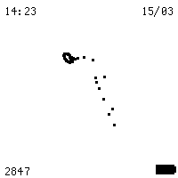

# Chaos - Lorenz Attractor Watch Face for Watchy

A mesmerizing watch face for the Watchy ESP32 smartwatch featuring a real-time evolving Lorenz attractor pattern. Watch the beautiful chaos unfold on your wrist with a continuously updating 3D trajectory that rotates and evolves every 3 seconds.



*Demo animation showing the Lorenz attractor pattern on the Watchy display*

## Features

- **Real-time Lorenz Attractor**: Live 3D chaotic system simulation using Runge-Kutta 4th order integration
- **Persistent State**: RTC memory storage ensures continuous evolution across deep sleep cycles
- **Fast Updates**: 3-second refresh rate with 50 new trajectory points each update
- **3D Rotation**: Dynamic rotating view of the attractor pattern
- **Large Display**: 190x190 pixel drawing area (95% of screen)
- **Standard Watch Features**: Time, date, battery indicator, and step counter
- **Power Efficient**: Optimized for Watchy's deep sleep architecture

## Technical Details

### Lorenz System Parameters
- **σ (Sigma)**: 10.0 - Prandtl number
- **ρ (Rho)**: 28.0 - Rayleigh number  
- **β (Beta)**: 8/3 - Geometric factor
- **Time Step**: 0.05 - Integration step size
- **Max Points**: 300 - Circular buffer size

### Performance
- **Integration Steps**: 50 per update (2.5 time units)
- **Wake-up Frequency**: Every 3 seconds
- **Evolution Rate**: 1,000 points per minute
- **Memory Usage**: RTC persistent state variables

## Project Structure

```
chaos/
├── chaos/
│   ├── chaos.ino             # Main watch face implementation
│   └── settings.h            # Configuration parameters
├── docs/
│   ├── installation.md       # Setup and installation guide
│   ├── configuration.md      # Customization options
│   ├── technical.md         # Technical implementation details
│   └── images/              # Documentation images
├── examples/
│   ├── custom_configs/      # Example configuration files
│   └── gifs/                # Demo GIF animations
├── tools/
│   └── chaos_demo.py        # GIF generator script
├── LICENSE                  # MIT License
└── README.md               # This file
```

## Quick Start

### Prerequisites
- Arduino IDE 2.0+
- ESP32 Arduino Core 2.0.5+
- Watchy library
- Watchy ESP32 smartwatch

### Installation

1. **Clone the repository**:
   ```bash
   git clone https://github.com/yourusername/lorenz-attractor-watchy.git
   cd lorenz-attractor-watchy
   ```

2. **Install Watchy library**:
   - Open Arduino IDE
   - Go to Tools → Manage Libraries
   - Search for "Watchy" and install

3. **Configure Arduino IDE**:
   - Select Board: "Watchy" (ESP32)
   - Select Port: Your Watchy's USB port
   - Ensure ESP32 Arduino Core 2.0.5+ is installed

4. **Upload the code**:
   - Open `chaos/chaos.ino` in Arduino IDE
   - Click Upload
   - Wait for upload to complete

### First Run
- The watch will automatically start showing the Lorenz attractor
- The pattern will begin evolving immediately
- Wake-up every 3 seconds for continuous evolution

## Demo GIF Generator

The `tools/chaos_demo.py` script generates a preview GIF showing how the Lorenz attractor appears on the Watchy display:

```bash
cd tools
python3 chaos_demo.py
```

This creates `chaos_watchy_demo.gif` in the `examples/gifs/` directory, simulating the actual watch face behavior with:
- 3D rotating Lorenz attractor pattern
- Watch elements (time, date, battery, steps)
- E-ink display simulation
- 30-frame animation at 10 FPS

## Configuration

Edit `chaos/settings.h` to customize behavior:

```cpp
// Wake up settings
#define WAKE_UP_INTERVAL_MINUTES 0.05  // 3 seconds

// Lorenz attractor settings  
#define LORENZ_POINTS_PER_UPDATE 50    // Points per refresh
#define LORENZ_MAX_POINTS 300          // Trajectory buffer size
#define LORENZ_ROTATION_SPEED 0.5      // Rotation speed
```

## Customization

### Adjusting Evolution Speed
- **Faster evolution**: Increase `LORENZ_POINTS_PER_UPDATE`
- **Slower evolution**: Decrease `LORENZ_POINTS_PER_UPDATE`
- **More detail**: Increase `LORENZ_MAX_POINTS`

### Changing Wake-up Frequency
- **Faster updates**: Decrease `WAKE_UP_INTERVAL_MINUTES`
- **Battery saving**: Increase `WAKE_UP_INTERVAL_MINUTES`

### Visual Adjustments
- **Larger pattern**: Modify window bounds in `drawTrajectory()`
- **Different rotation**: Adjust `LORENZ_ROTATION_SPEED`

## Troubleshooting

### Common Issues

**Pattern not evolving**:
- Ensure RTC memory is working (variables prefixed with `RTC_DATA_ATTR`)
- Check that wake-up timer is functioning
- Verify integration parameters

**Compilation errors**:
- Ensure ESP32 Arduino Core 2.0.5+ is installed
- Check Watchy library version compatibility
- Verify board selection is "Watchy"

**Display issues**:
- Check screen bounds in `drawTrajectory()`
- Verify scaling parameters
- Ensure proper centering

### Debug Mode
Add debug output by uncommenting debug sections in the code:
```cpp
// Uncomment for point count display
// display.print("P:"); display.print(g_pointCount);
```

## Performance Metrics

- **Battery Life**: ~7-10 days with 3-second updates
- **Memory Usage**: ~2KB RTC memory for state persistence
- **CPU Usage**: Minimal during deep sleep, brief activity during updates
- **Display Refresh**: Full e-ink refresh every 3 seconds

## Contributing

Contributions are welcome! Please feel free to submit a Pull Request. For major changes, please open an issue first to discuss what you would like to change.

### Development Setup
1. Fork the repository
2. Create a feature branch
3. Make your changes
4. Test thoroughly on actual Watchy hardware
5. Submit a pull request

## License

This project is licensed under the MIT License - see the [LICENSE](LICENSE) file for details.

## Acknowledgments

- **Watchy Team**: For the amazing ESP32 smartwatch platform
- **Edward Lorenz**: For discovering the Lorenz attractor system
- **Arduino Community**: For the excellent development tools
- **ESP32 Community**: For the robust IoT platform

## References

- [Watchy Documentation](https://watchy.sqfmi.com/)
- [Lorenz Attractor](https://en.wikipedia.org/wiki/Lorenz_system)
- [Runge-Kutta Methods](https://en.wikipedia.org/wiki/Runge%E2%80%93Kutta_methods)
- [ESP32 Deep Sleep](https://docs.espressif.com/projects/esp-idf/en/latest/esp32/api-reference/system/deep_sleep.html)

---

**Made with love for the Watchy community**

*Watch the beauty of chaos unfold on your wrist*